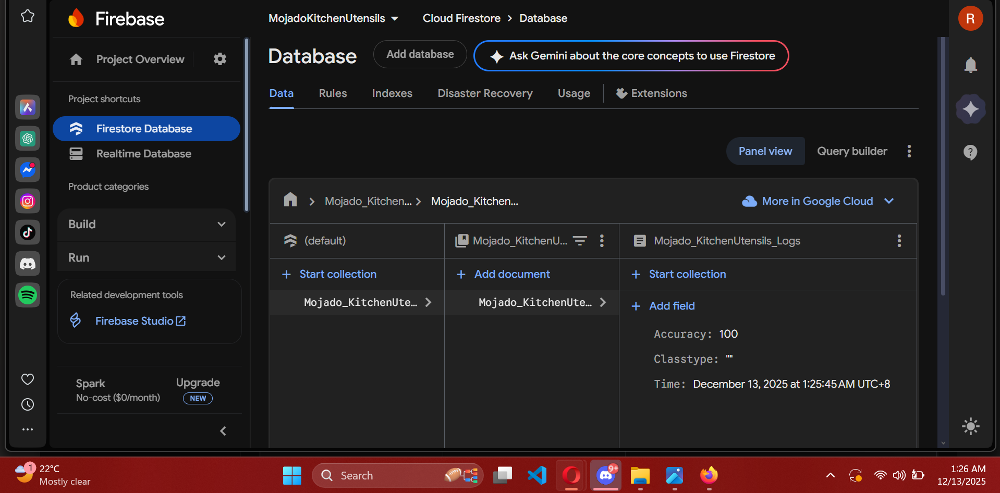
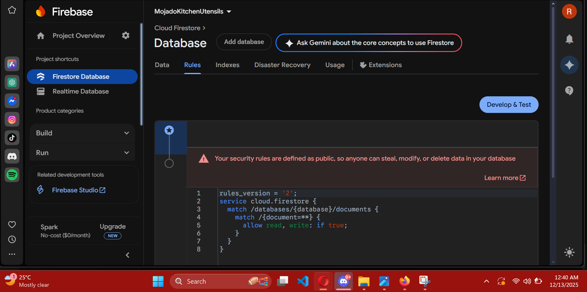
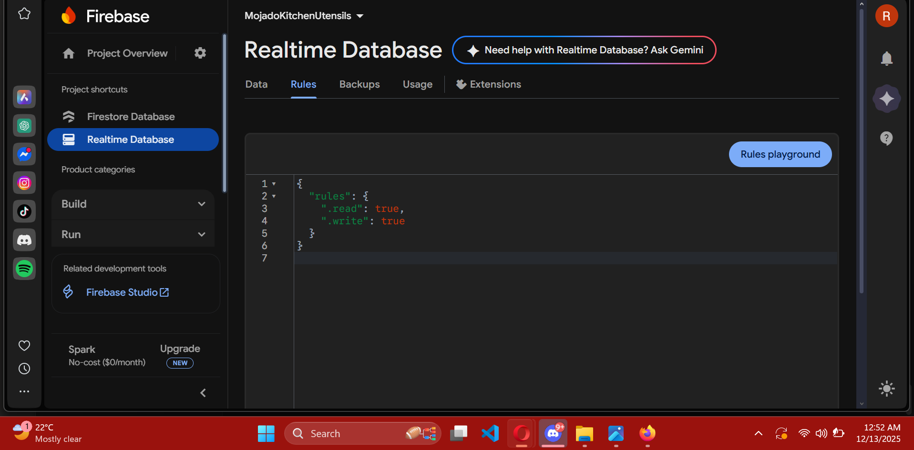

# MojadoKitchenUtensils: Firebase Backend Setup

## 📋 Project Overview
This repository contains the complete Firebase backend configuration for the **MojadoKitchenUtensils** project. It documents the setup of essential cloud services including Cloud Firestore and Realtime Database, following the project specifications for logging and data management.

## 🛠️ Implementation Details
Successfully implemented the required backend infrastructure:
*   **Cloud Firestore Database:** Configured with a dedicated collection (`Mojado_KitchenUtensils_Logs`) for structured data logging.
*   **Data Model:** Created documents with fields for `Accuracy` (Number), `ClassType` (String), and `Time` (Timestamp).
*   **Realtime Database:** Established a separate Realtime Database instance for potential real-time features.
*   **Security Rules:** Configured initial security rules for both databases in test mode for development.

## 📸 Setup Documentation

### 1. Cloud Firestore Database
This screenshot shows the created `Mojado_KitchenUtensils_Logs` collection with the initial document containing the required fields.

### 2. Cloud Firestore Security Rules
Initial security rules configured for the development phase.

### 3. Realtime Database
The Realtime Database console showing the successfully initialized database structure.

### 4. Realtime Database Security Rules
Security rules for the Realtime Database, set with an expiration date for development access.

## 🚀 Next Steps
This setup provides a solid foundation. The next phase can involve:
*   Integrating this backend with a Flutter frontend application.
*   Implementing more granular security rules for production.
*   Adding additional collections or data structures as the project scales.

---
*This setup was completed as part of the Week 10-17 module: **Backend Services and APIs**.*
